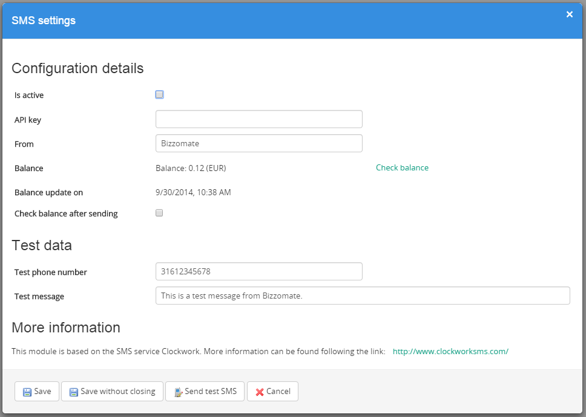
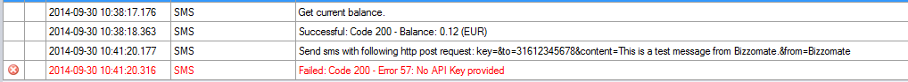

Sms
===

##Description
This module enables SMS sending via a Mendix application. A Clockwork account is required and can be acquired via [http://www.clockworksms.com/](http://www.clockworksms.com/). 

##Typical usage scenario
For sending a sms for e.g. a notification, two factor authentication or verification of a new account.

##Features and limitations
- Plug 'n play Mendix module for easy sending sms messages.
- 1 message can contain up to 160 characters with a maximum of 459 characters and results in 3 messages.
- The sender is optional.
- A ClockworkSms account is required.
- Multiple networks are covered.

##Screenshots
Settings

Logging

##Roadmap
- Other sms providers -> To be defined and to be determined.
